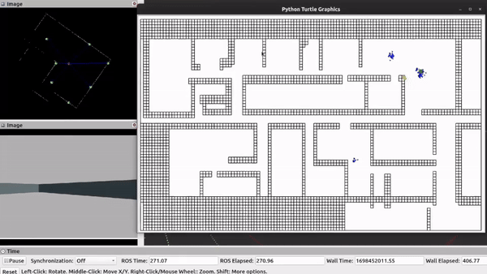

## Repository description

A repository containing sub-projects relating to an application of concepts within Robotics using the common tech stack such as: ROS, RViz, Gazebo, CARLA, Python (OpenCV). These projects include a variety of topics, such as but not limited to:

A camera-based lane detection algorithm:

Robot localization using Particle Filters:

An evaluation of SLAM system performance in different environments:

## UIUC Academic Integrity

DO NOT COPY. Only for reference. I hereby state that I shall not be held responsible for any misuse of my work or any academic integrity violations.